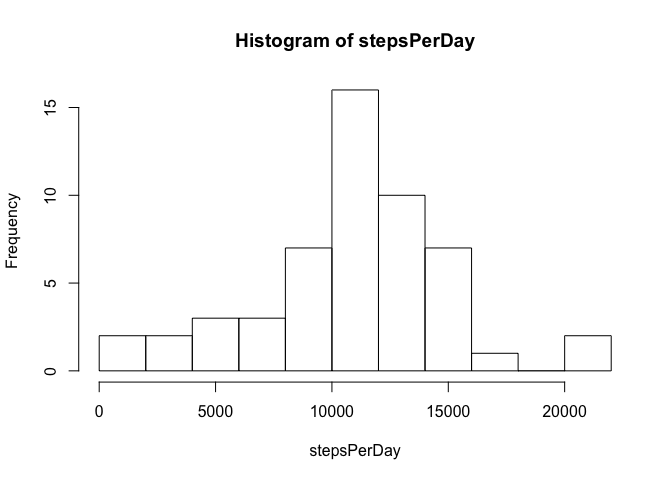
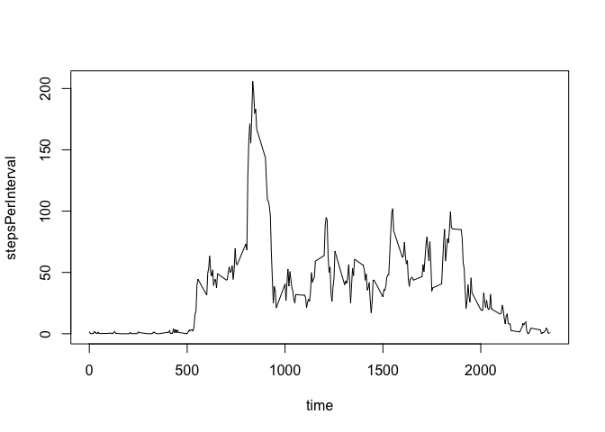
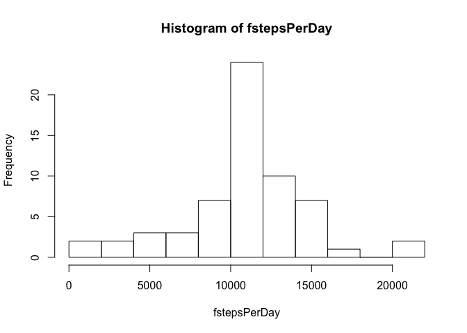
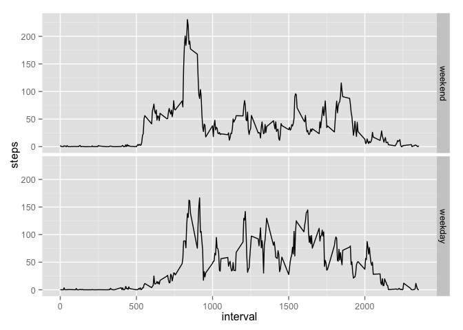

# Reproducible Research: Peer Assessment 1


## Loading and preprocessing the data
First read the data, you have to be in the right directory before...


```r
activity <- read.csv("activity.csv")
```

## What is mean total number of steps taken per day?
Then we compute the sum of teps each days and display a summary of the compute variable ; so we have mean and median of steps per day.

```r
stepsPerDay <- tapply(activity$steps,activity$date,sum)
hist(stepsPerDay,breaks=10)
```

 

```r
summary(stepsPerDay)
```

```
##    Min. 1st Qu.  Median    Mean 3rd Qu.    Max.    NA's 
##      41    8841   10760   10770   13290   21190       8
```

## What is the average daily activity pattern?

```r
stepsPerInterval <- tapply(activity$steps,activity$interval,mean,na.rm=TRUE)
time <- row.names(stepsPerInterval)
plot(time,stepsPerInterval,type="l")
```

 

```r
mymax <- which.max(stepsPerInterval)
```
The maximum activity is at 835, the value of max is 206.1698113.


## Imputing missing values
1. Calculate the total number of missing values in the dataset

```r
sum(is.na(activity$steps))
```

```
## [1] 2304
```
2. We choose to replace the missing values with mean of the corresponding interval (already compute at the previous point)
3. the new dataset is create with this code :

```r
factivity <- activity
for (i in 1:length(activity$steps))
    { if(is.na(activity$steps[i])) 
        factivity$steps[i] <- stepsPerInterval[as.character(activity$interval[i])]
    }
```
4. Do the same as question 2 with the new dataset

```r
fstepsPerDay <- tapply(factivity$steps,factivity$date,sum)
hist(fstepsPerDay,breaks=10)
```

 

```r
summary(fstepsPerDay)
```

```
##    Min. 1st Qu.  Median    Mean 3rd Qu.    Max. 
##      41    9819   10770   10770   12810   21190
```
The Mean is the same as before, the Median is a little different.

## Are there differences in activity patterns between weekdays and weekends?

We can see on this figure the differences between weekday dauys and weekend days.

```r
library(ggplot2)
weekend=c("Samedi","Dimanche")
#english version
#weekend=c("Saturday","Sunday")
factivity$weekend <- factor(weekdays(as.Date(factivity$date)) %in% weekend,labels=c("weekend","weekday"))
stepsPerInterval2 <- aggregate(steps ~ interval + weekend,factivity,mean)
qplot(interval,steps,data=stepsPerInterval2,facets=weekend ~ .,geom="line")
```

 

